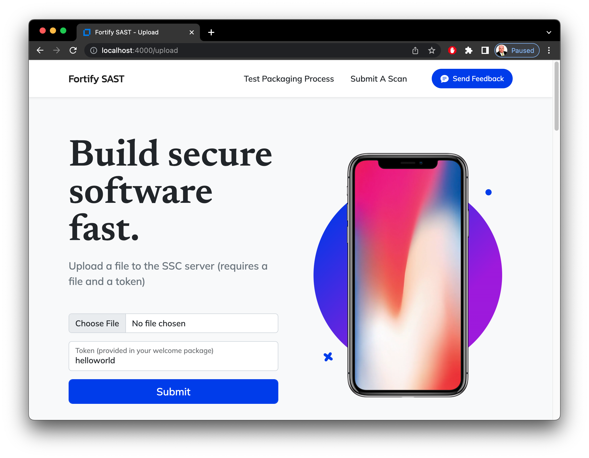
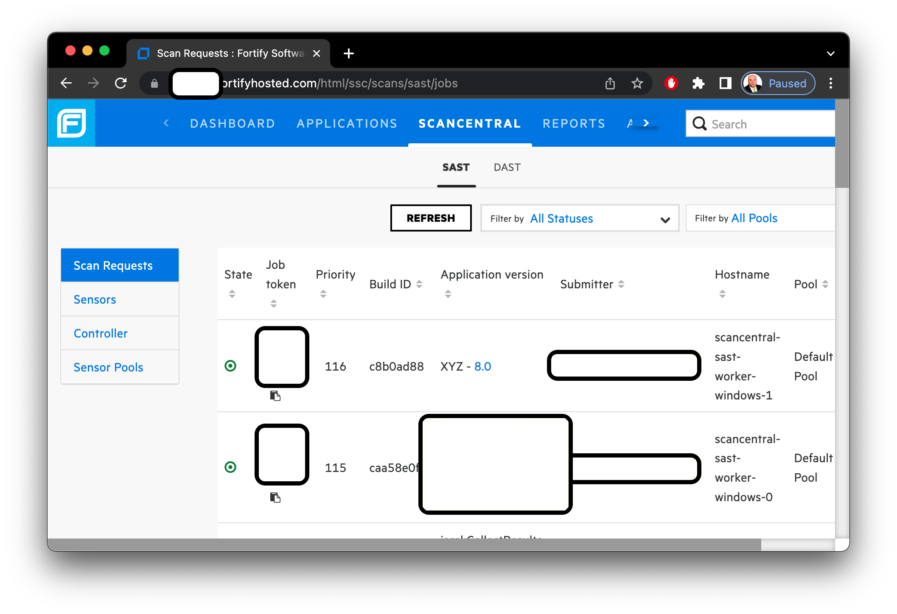
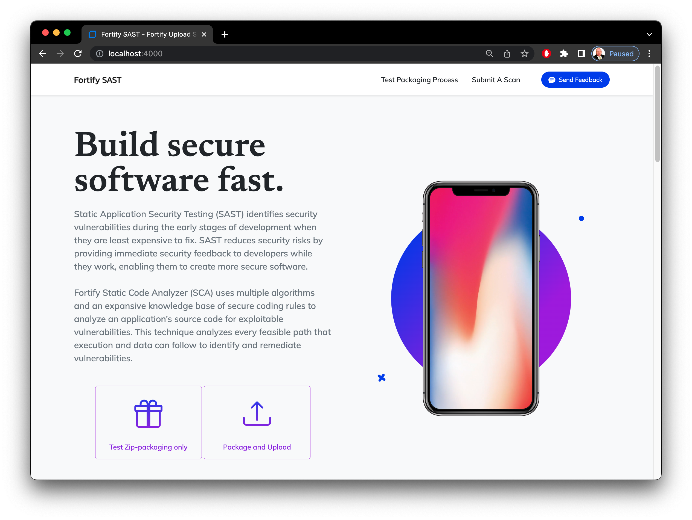

# fortify-upload using CURL
Below are examples how to interact with this Express application via CURL

`Note: I have changed all command lines to support the "*/json" accept header.  Not providing a JSON-compatible accept type will return HTML instead.` 

# [](https://curl.se/)

or, if you are old-school like me...

```
                                                                                      
                                                                                      
        CCCCCCCCCCCCCUUUUUUUU     UUUUUUUURRRRRRRRRRRRRRRRR   LLLLLLLLLLL             
     CCC::::::::::::CU::::::U     U::::::UR::::::::::::::::R  L:::::::::L             
   CC:::::::::::::::CU::::::U     U::::::UR::::::RRRRRR:::::R L:::::::::L             
  C:::::CCCCCCCC::::CUU:::::U     U:::::UURR:::::R     R:::::RLL:::::::LL             
 C:::::C       CCCCCC U:::::U     U:::::U   R::::R     R:::::R  L:::::L               
C:::::C               U:::::D     D:::::U   R::::R     R:::::R  L:::::L               
C:::::C               U:::::D     D:::::U   R::::RRRRRR:::::R   L:::::L               
C:::::C               U:::::D     D:::::U   R:::::::::::::RR    L:::::L               
C:::::C               U:::::D     D:::::U   R::::RRRRRR:::::R   L:::::L               
C:::::C               U:::::D     D:::::U   R::::R     R:::::R  L:::::L               
C:::::C               U:::::D     D:::::U   R::::R     R:::::R  L:::::L               
 C:::::C       CCCCCC U::::::U   U::::::U   R::::R     R:::::R  L:::::L         LLLLLL
  C:::::CCCCCCCC::::C U:::::::UUU:::::::U RR:::::R     R:::::RLL:::::::LLLLLLLLL:::::L
   CC:::::::::::::::C  UU:::::::::::::UU  R::::::R     R:::::RL::::::::::::::::::::::L
     CCC::::::::::::C    UU:::::::::UU    R::::::R     R:::::RL::::::::::::::::::::::L
        CCCCCCCCCCCCC      UUUUUUUUU      RRRRRRRR     RRRRRRRLLLLLLLLLLLLLLLLLLLLLLLL
                                                                                      
                                                                                      
 dP""b8  dP"Yb  8888b.  888888     .dP"Y8  dP""b8    db    88b 88 88b 88 888888 88""Yb 
dP   `" dP   Yb  8I  Yb 88__       `Ybo." dP   `"   dPYb   88Yb88 88Yb88 88__   88__dP 
Yb      Yb   dP  8I  dY 88""       o.`Y8b Yb       dP__Yb  88 Y88 88 Y88 88""   88"Yb  
 YboodP  YbodP  8888Y"  888888     8bodP'  YboodP dP""""Yb 88  Y8 88  Y8 888888 88  Yb 

             ________         _   _  __       
            / /  ____|       | | (_)/ _|      
 __      __/ /| |__ ___  _ __| |_ _| |_ _   _ 
 \ \ /\ / / / |  __/ _ \| '__| __| |  _| | | |
  \ V  V / /  | | | (_) | |  | |_| | | | |_| |
   \_/\_/_/   |_|  \___/|_|   \__|_|_|  \__, |
                                         __/ |
                                        |___/ 
___.               _________  .__            .__             _____.___.                          ____   
\_ |__  ___.__.    \_   ___ \ |  |__ _______ |__|  ______    \__  |   |  ____   __ __   ____    / ___\  
 | __ \<   |  |    /    \  \/ |  |  \\_  __ \|  | /  ___/     /   |   | /  _ \ |  |  \ /    \  / /_/  > 
 | \_\ \\___  |    \     \____|   Y  \|  | \/|  | \___ \      \____   |(  <_> )|  |  /|   |  \ \___  /  
 |___  // ____|     \______  /|___|  /|__|   |__|/____  >     / ______| \____/ |____/ |___|  //_____/   
     \/ \/                 \/      \/                 \/      \/                           \/           
                                                                                                        
```


----------
## Getting started / Firing up the Express site


First, make sure to fetch your node_module dependencies by starting with an npm update -- [package.json](package.json) contains the required dependencies and they may be updated using:

```console

npm update

```

To run the app, use these respective commands for *Nix/Mac, Powershell, and Windows command line:

```console
DEBUG=fortify-upload:* npm start
ENV:DEBUG = "fortify-upload:*"; npm start
SET DEBUG=fortify-upload:* & npm start
```

You can also start this up with nodemon so that node restarts the script with any file edits:

```console
DEBUG=fortify-upload:* npm run devstart
ENV:DEBUG = "fortify-upload:*"; npm run devstart
SET DEBUG=fortify-upload:* & npm run devstart
```

Now startup a browser to [http://localhost:4000](http://localhost:4000) and voila, "Bob's your uncle"

----------
## ScanCentral Packaging

To effectively test, you'll need some source code to zip up and package.  The scancentral client cli has a `package` command.

This is an optional step which may be required for advanced use cases.  Otherwise, simple projects can simply have their source code zipped using regular old zip tools.

[Install](https://www.microfocus.com/documentation/fortify-software-security-center/2220/SC_SAST_Guide_22.2.0.pdf) the [Scan Central Client](https://tools.fortify.com/scancentral/Fortify_ScanCentral_Client_22.1.0_x64.zip) which is available from the SFTP site provided in your welcome packet, including binaries for other platforms besides windows.  This [github actions project](https://github.com/fortify/gha-setup-scancentral-client) is also handy.

```console

cd /some/directory/where/your/source/code/lives

scancentral package -o sourcecode.packaged.zip -bt none

```

At the conclusion of this step, you'll have a zip file called `sourcecode.packaged.zip`


----------
## Uploading a Package

The process below is the curl command line equivalent of working with the `/upload` or `"Submit a scan"` form in the UI:



First, be sure to edit [tokens.json](tokens.json) so that it contains valid tokens.  Each token object contains several properties:

1. **key** : Single-Use-Token that can be freeform and as complex as you desire.  This is the lookup key (examples use `helloworld`) when running curl commands below.
2. **token** : A valid ScanCentral token in the GUID-style format
3. **project**: The project name this scan will apply to in SSC (example `XYZ`)
4. **version**: The version to which this will apply (example `8.0`)
5. **user**: Some value that uniquely identifies the submitting user (email makes a great choice)

```javascript

{
    "client": "************************************************",
    "url": "https://scsastctrl.fortifyhosted.com/scancentral-ctrl/rest/v2/job",
    "tokens": [
        {
            "key": "helloworld",
            "token": "********-****-****-****-************"
            "project": "XYZ",
            "version": "8.0",
            "user": "hello.world@domain.com",

```


Then, to run a upload with the file named `sourcecode.packaged.zip` and key `helloworld`:

```console

root@localhost fortify-upload % curl -i -H "accept:*/json" -F "file=@sourcecode.packaged.zip" -F "token=helloworld" http://localhost:4000/upload
HTTP/1.1 200 OK
X-Powered-By: Express
Content-Type: application/json; charset=utf-8
Content-Length: 167
ETag: W/"a7-EPAgCftAoMTShK4Uzbolj9nD4WU"
Vary: Accept-Encoding
Date: Mon, 15 May 2023 22:51:21 GMT
Connection: keep-alive
Keep-Alive: timeout=5

{"success":true,"token":"helloworld","messages":[],"response":{"token":"********-18ba-4ab2-83cf-************","detailsMessage":null,"time":"2023-05-15T22:51:21.562Z"}}

```

After a few seconds, the job should show up under `ScanCentral` > `SAST` > `Scan Requests`:




If attempting to submit again, you'll recieve a 500 error and a description of the issue:

```console

root@localhost fortify-upload % curl -i -H "accept:*/json" -F "file=@sourcecode.packaged.zip" -F "token=helloworld" http://localhost:4000/upload
HTTP/1.1 500 Internal Server Error
X-Powered-By: Express
Content-Type: application/json; charset=utf-8
Content-Length: 238
ETag: W/"ee-0wLVYbV1e+oGw+XK3I4opx9v8lU"
Vary: Accept-Encoding
Date: Mon, 15 May 2023 22:51:52 GMT
Connection: keep-alive
Keep-Alive: timeout=5

{"success":false,"token":"helloworld","messages":["Previously submitted on 'Mon May 15 2023 18:51:21 GMT-0400 (Eastern Daylight Time)' with jobtoken '********-18ba-4ab2-83cf-************'. ","Must wait 12 hours before submitting again."]}

```

Dropping the `-i` switch will eliminate header printing:

```
root@localhost fortify-upload % curl -H "accept:*/json" -F "file=@sourcecode.packaged.zip" -F "token=helloworld" http://localhost:4000/upload   
{"success":false,"token":"helloworld","messages":["Previously submitted on 'Mon May 15 2023 18:51:21 GMT-0400 (Eastern Daylight Time)' with jobtoken '********-18ba-4ab2-83cf-************'.","Must wait 12 hours before submitting again."]}

```

----------
## Testing Uploads

Examples show how to test the packaging process to ensure good files are sent:

```
root@localhost fortify-upload % curl -H "accept:*/json" -F "file=@sourcecode.unpackaged.zip" http://localhost:4000/test > test.unpackaged.zip 
  % Total    % Received % Xferd  Average Speed   Time    Time     Time  Current
                                 Dload  Upload   Total   Spent    Left  Speed
100 17874  100 15571  100  2303   140k  21212 --:--:-- --:--:-- --:--:--  174k

root@localhost fortify-upload % curl -H "accept:*/json" -F "file=@sourcecode.packaged.zip" http://localhost:4000/test > test.packaged.zip
  % Total    % Received % Xferd  Average Speed   Time    Time     Time  Current
                                 Dload  Upload   Total   Spent    Left  Speed
100  864k  100  636k  100  228k  6378k  2288k --:--:-- --:--:-- --:--:-- 9393k
```

This is analogous to clicking the `Test Zip-packaging only` button within the UI:




If you botch the command line syntax, you'll recieve a 500 error:

```

root@localhost fortify-upload % curl -H "accept:*/json" -F "file=zx" http://localhost:4000/test
{"message":"No file uploaded"}

```

The same applies to the upload command.  Note the `@` symbol was dropped from the file upload, resulting in a string `"file=sourcecode.packaged.zip"` sent rather than a file upload.

```

root@localhost fortify-upload % curl -H "accept:*/json" -F "file=sourcecode.packaged.zip" -F "token=helloworld" http://localhost:4000/upload
{"success":false,"token":"helloworld","messages":["No file uploaded"]}

```

----------
## Reports

After giving your application some time to scan you may request a PDF report to be generated.  


Note that you'll need to provide the ProjectVersion Id (example `12345`) and the output file (example `reportxyz.pdf`):

```

root@localhost fortify-upload % curl -H "accept:*/json" http://localhost:4000/sast/report/12345 > reportxyz.pdf
  % Total    % Received % Xferd  Average Speed   Time    Time     Time  Current
                                 Dload  Upload   Total   Spent    Left  Speed
100  239k  100  239k    0     0  27431      0  0:00:08  0:00:08 --:--:-- 52059

```

Attempting to provide a non-numeric value (example `XYZ`) will error with a 500:

```

root@localhost fortify-upload % curl -H "accept:*/json" http://localhost:4000/sast/report/XYZ
{"version":"XYZ","messages":["Project Version Id 'XYZ' must be an integer value"]}

```

Note: Currently this command takes a few seconds to run.  Although fetched asyncronously, the report generation itself may take a few seconds on the server.  Thus, the HTTP handler probes SCC for a report id handle every few seconds until the report completes.  It would be a good idea to throttle this handler similar to the one-time token use.