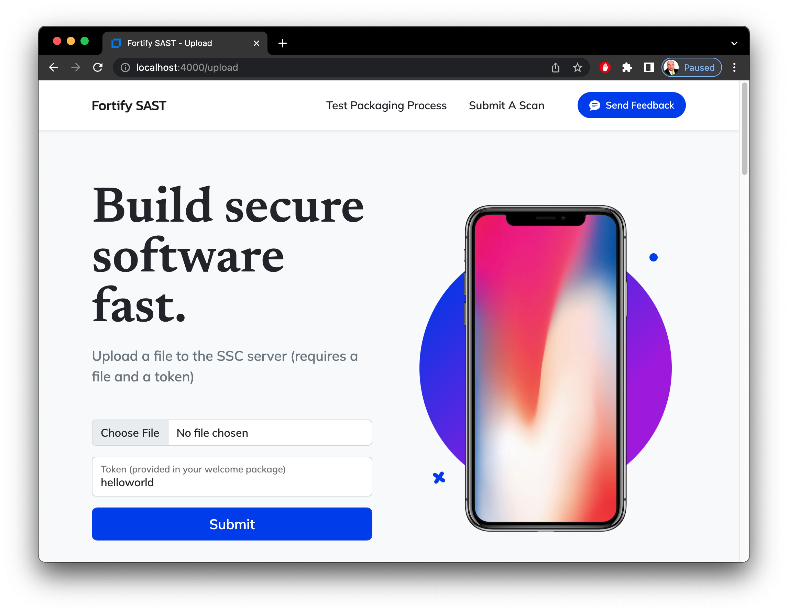

# fortify-upload
An example Node/Express site that demonstrates how to package and upload files to a Fortify Static Code Analyzer (SAST) controller without any client-side installation.



The main functions are in a CommonJS module called [fortify-upload.js](fortify-upload.js).  This application is also CURL friendly with all routes/endpoints support adding a `"*/json"` accept header to change their output to JSON instead of HTML.  The HTML interface also offers "coaching" on how to issue the CURL commands:  As you type into the HTML forms, a bootstrap card will show the CURL commands that duplicate the form submission.  See the [CURLMAN.md](CURLMAN.md) page or watch this video for more details:


 [](https://youtu.be/oxnUeXrasMQ)


Originally I kept the data persistence very simple using a JSON file.  I am currently branching out to use a CosmosDB and will likely develop other connectors.  Read below for how to configure.


----------
## Configuration
First, start with an npm update -- [package.json](package.json) contains the required dependencies and they may be fetched using:
```console
npm update
```


Next decide which database/persisence method you'd like to use for token storage.  If using cosmos, edit [.config.json](.config.json) and be sure to use `tokens.type` = `"cosmos"`:

```javascript
{
    "tokens": {
        "type": "cosmos",
        "connectionstring": "AccountEndpoint=https://yourHost.azure.com:443/;AccountKey=***YourKey***;",
        "database": "fortify",
        "container": "yourNamedCollection",
```

If choosing json, change the `tokens.type` to `"json"`.  Then edit [.tokens.json](.tokens.json) to contain your items:

```javascript
{
    "tokens": [
        {
            "id": "helloworld",
            "token": "********-****-****-****-************",
            "project": "MyProject",
            "version": "1.0",
            "user": "hello.world@domain.com"
        },
```

In addition to configuring the token storage, you'll need to set the details for your SSC and SAST scan controllers.

```javascript
    "ssc": {
        "url": "https://ssc.fortifyhosted.com",
        "token": "************************************************",
        "decoded": "********-****-****-****-************",
        "basic": "username:password"
    },
    "sast": {
        "url": "https://scsastctrl.fortifyhosted.com/scancentral-ctrl",
        "client": "YourClientAuthKey"
    }
}
```


Notes:
1. "sast.client" is your Fortify client_auth_token provided in your welcome packet (aka. the client_auth_token in your client.properties file if using any of the Fortify command-line utilities.)
2. "*.url" is your controller and ssc url endpoints
3. "ssc.token" is a valid CIToken within SSC with sufficient privleges to execute the API.  Sent as an `Authorization: FortifyToken <token>` http header to API endpoints.
4. "ssc.decoded" is the base64decoded value of "ssc.token".  This is the value is typically used with the scancentral client tools and is the value sent to the controller when submitting a scan job.
5. "ssc.basic" is the HTTP basic authentication format username-colon-password (username:password) that is required by some endpoints that do not accept a token (i.e. Making users or creating CITokens).  This will be sent as an `Authorization: Basic <Base64EncodedCredentials>` http header to API endpoints.


Tokens have the following characteristics regardless of their persistence implementation:

1. `"id": "helloworld"`, The token that will be shared publicly to end users who wish to submit code.  Make this long and complex.  They will use this token within CURL commands.
2. `"token": "********-****-****-****-************"`, This is a valid SSC CIToken (decoded format) that is not shared.  Instead, this handler (invoked through either HTML or CURL) will use the ID value to lookup and extract this token along with the project, version, and user information.  This real CIToken will be used to submit code on behalf of the user and they will be shielded from ever knowing its' value.
3. `"project": "MyProject"`, the SSC project tied to this user token
4. `"version": "1.0"`, the SSC project version
5. `"user": "hello.world@domain.com"`, an identifier used to identify the user to the controller.  This is merely a hashtag and does not have to be a valid SSC user.  Email addresses do make good values for association.


----------
## Starting Up

To run the app, use these respective commands for *Nix/Mac, Powershell, and Windows command line:

```console
DEBUG=fortify-upload:* npm start
ENV:DEBUG = "fortify-upload:*"; npm start
SET DEBUG=fortify-upload:* & npm start
```

You can also start this up with nodemon so that node restarts the script with any file edits:

```console
DEBUG=fortify-upload:* npm run devstart
ENV:DEBUG = "fortify-upload:*"; npm run devstart
SET DEBUG=fortify-upload:* & npm run devstart
```

Now startup a browser to [http://localhost:4000](http://localhost:4000) and voila, "Bob's your uncle":


----------
## Command Line Testing
You can test the API integrations by creating async javascript functions in [fortify-upload.js](fortify-upload.js) and run via node command line: `node fortify-upload.js`

Example:
```javascript
//* Testing:
async function main() {
    // const x = await zip.translationFromInput(fs.readFileSync("vulnerable-node-master.zip"),"helloworld")   // Zip Buffer (optionally name it)
    // const x = await zip.translationFromInput(fs.readFileSync("./fortify-upload.js"))    // Regular File Buffer
    // const x = await zip.translationFromInput("./vulnerable-node-master")             // Directory
    // const x = await zip.translationFromInput("./fortify-upload.js")                  // Regular file
    // const x = await zip.translationFromInput("./vulnerable-node-master.zip")         // Zip File
    // fs.writeFileSync("zip-output.zip", x)
    const x = await zip.translationFromInput("./")             // Directory
    // $(JSON.stringify(x))
}
main()
//*/
```

----------
## Sample Apps for Testing
For your ease, I've included an example app to scan called [vulnerable-node-master.zip](vulnerable-node-master.zip).  It is also available in directory form [vulnerable-node-master/](vulnerable-node-master/).


----------
## Alternative Method for Uploading: ScanCentral Packaging and FCLI

Besides this Express application, there are alternative methods to package and submit SAST jobs.  Below is documentation on how to issue identical commands through:

1. `The ScanCentral Client`: [Install](https://www.microfocus.com/documentation/fortify-software-security-center/2220/SC_SAST_Guide_22.2.0.pdf) the latest [Scan Central Client](https://tools.fortify.com/scancentral/Fortify_ScanCentral_Client_Latest.zip).  At the time of this writing, version [22.1.0](https://tools.fortify.com/scancentral/Fortify_ScanCentral_Client_22.1.0_x64.zip) is the active version.  This [github actions project](https://github.com/fortify/gha-setup-scancentral-client) is also handy.
2. `FCLI`: Available [here](https://github.com/fortify/fcli) 
3. `JavaScript` using the [fortify-upload.js](fortify-upload.js) CommonJS module


ScanCentral SAST controllers can be quite picky about their acceptable input format for source code.  Thus, it is best to begin by issuing a `package` command using the scancentral client cli.


```console

cd /some/directory/where/your/source/code/lives

scancentral package -o sourcecode.packaged.zip -bt none

```

At the conclusion of this step, you'll have a zip file called `sourcecode.packaged.zip` with this basic format:

> 
> - `sourcecode.packaged.zip`
>   - `translation.zip`
>       - `Src/`  : A directory containing the original source code (example: the contents from /some/directory/where/your/source/code/lives)
>       - `metadata` : A manifest file describing which root directory to scan (usually /Src).  See zip.metadata() in the [fortify-upload.js](fortify-upload.js) for a better understanding.
>


The ScanCentral `pacakge` command is best for advanced use cases, but simple projects can be zipped using regular old zip tools.  Be sure to follow the desired format listed above, including making a `metadata` file.  This JavaScript code from [fortify-upload.js](fortify-upload.js) performs the same similar task:

``` Javascript
async function main() {
    const x = await zip.translationFromInput("/some/directory/where/your/source/code/lives")    // Directory
    fs.writeFileSync("sourcecode.packaged.zip", x)
}
main()
```

After you have packaged your source code, the following commands are identical across the 3 implementations:

``` console

# ScanCentral
scancentral -url https://scsastctrl.fortifyhosted.com/scancentral-ctrl start -upload --application MyProject --application-version 1.0 --package sourcecode.packaged.zip -uptoken `token`

# FCLI
fcli sc-sast session login -c=`client_auth_key` --ssc-url=https://ssc.fortifyhosted.com/ -t=`token`
fcli sc-sast scan start --package-file=sourcecode.packaged.zip --appversion=MyProject:1.0 --sensor-version=22.2.2.0004
fcli sc-sast session logout

```

``` Javascript

async function main() {
    const x = require("fs").readFileSync("sourcecode.packaged.zip")
    const y = await u.upload("https://scsastctrl.fortifyhosted.com/scancentral-ctrl",x,"sourcecode.packaged.zip","client_auth_key","token", "MyProject", "1.0", "username")
   console.log(y)
   // returns:  { token: 'jobtoken', detailsMessage: null }
}
main()

```
You could also CURL it:

```

curl -H "accept: application/json" -H "fortify-client: client_auth-key" -F "zipFile=@sourcecode.packaged.zip" -F "username=usename-from-curl" -F "scaVersion=22.2.1.0003" -F "scaRuntimeArgs=" -F "uploadToken=token" -F "jobType=TRANSLATION_AND_SCAN_JOB" -F "clientVersion=22.2.1.0003" -F "projectName=MyProject" -F "projectVersion=1.0" https://scsastctrl.fortifyhosted.com/scancentral-ctrl/rest/v2/job

```

