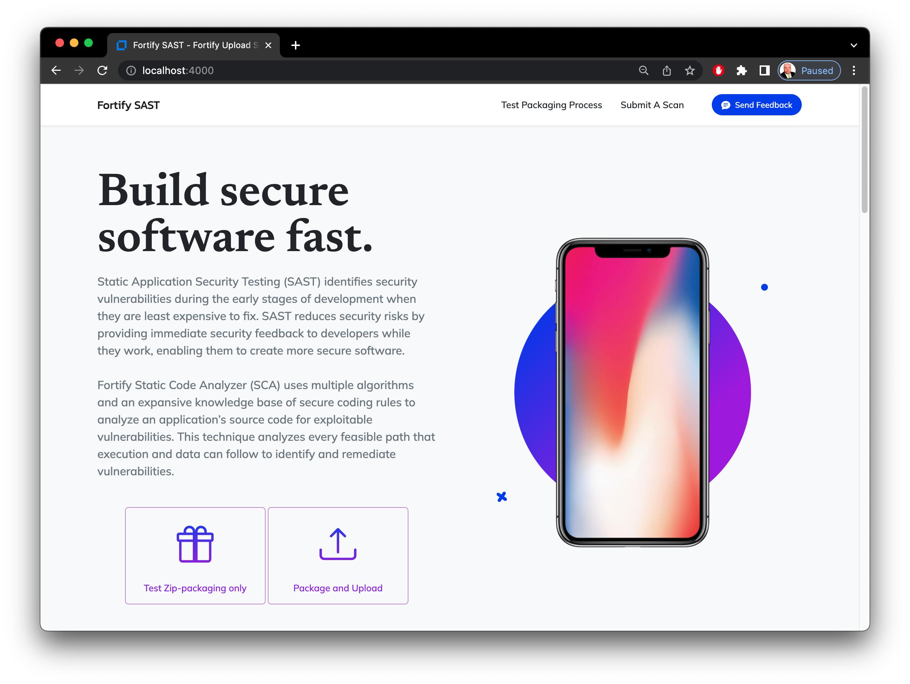

# fortify-upload
An example Node/Express site that demonstrates how to package and upload files to a Fortify Static Code Analyzer (SAST) controller.


The main functions are in a CommonJS module called [fortify-upload.js](fortify-upload.js)

To keep things simple, I've used a JSON file called [tokens.json](tokens.json) as the data persistence.

----------
## Configuration
First, start with an npm update -- [package.json](package.json) contains the required dependencies and they may be fetched using:
```console
npm update
```
Next edit [tokens.json](tokens.json) to contain your configuration information:

```javascript
{
    "client": "************************************************",
    "url": "https://scsastctrl.fortifyhosted.com/scancentral-ctrl/rest/v2/job",
    "tokens": [
        {
            "key": "helloworld",
            "token": "********-****-****-****-************"
            "project": "MyProject",
            "version": "1.0",
            "user": "hello.world@domain.com",
```
Notes:
1. "client" is your Fortify client_auth_token provided in your welcome packet (aka. the client_auth_token in your client.properties file if using any of the Fortify command-line utilities.)
2. "url" is your controller's url
3. "tokens" is an array of objects that map a token:key in this Express app to a real CIToken within SSC.
4. token:"key" is the value you'll submit on the front-end form.  Express will pluck the token object matching that key and translate it to the values SSC expects.
5. "token" is the authentication token value that will be sent to SCC
6. project, version, and user are also submitted when pushing a job

In my example above, submitting "helloworld" as the front-end token will match to the obfuscated SSC token (thing with asterisks that looks like a GUID) above.  It will also lift the project, version, and user to submit those fields.  So HTML.input[name="token"]="helloworld" operates a hashtag to find one of the items in the tokens array.  The other keys are mapped and sent to SCC along with the file you submit.

----------
## Starting Up

To run the app, use these respective commands for *Nix/Mac, Powershell, and Windows command line:

```console
DEBUG=fortify-upload:* npm start
ENV:DEBUG = "fortify-upload:*"; npm start
SET DEBUG=fortify-upload:* & npm start
```

You can also start this up with nodemon so that node restarts the script with any file edits:

```console
DEBUG=fortify-upload:* npm run devstart
ENV:DEBUG = "fortify-upload:*"; npm run devstart
SET DEBUG=fortify-upload:* & npm run devstart
```

Now startup a browser to [http://localhost:4000](http://localhost:4000) and voila, "Bob's your uncle":




----------
## Command Line Testing
You can also uncomment the `/* Testing:` line in [fortify-upload.js](fortify-upload.js) to `//* Testing:` and run via node command line: `node fortify-upload.js`

Example:
```javascript
//* Testing:
async function main() {
    // const x = await zip.translationFromInput(fs.readFileSync("vulnerable-node-master.zip"),"helloworld")   // Zip Buffer (optionally name it)
    // const x = await zip.translationFromInput(fs.readFileSync("./fortify-upload.js"))    // Regular File Buffer
    // const x = await zip.translationFromInput("./vulnerable-node-master")             // Directory
    // const x = await zip.translationFromInput("./fortify-upload.js")                  // Regular file
    // const x = await zip.translationFromInput("./vulnerable-node-master.zip")         // Zip File
    // fs.writeFileSync("zip-output.zip", x)
    const x = await zip.translationFromInput("./")             // Directory
    // $(JSON.stringify(x))
}
main()
//*/
```

----------
## Sample Apps for Testing
For your ease, I've included an example app to scan called [vulnerable-node-master.zip](vulnerable-node-master.zip).  It is also available in directory form [vulnerable-node-master/](vulnerable-node-master/).